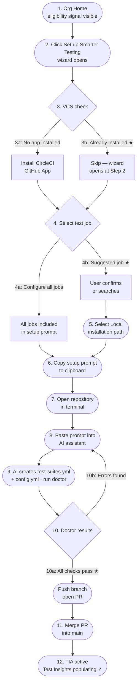

# User Flows: Smarter Testing Onboarding Wizard

---

## Local onboarding flow



> ★ marks the ideal path at each decision point.

---

## Background

Users arrive at the onboarding wizard after clicking "Set up Smarter Testing" in the Smarter Testing panel on the Pipelines page or Org Home. The wizard receives the project context (repo name, eligible features, pipeline job list) at open time.

The wizard guides the user through three steps: GitHub App installation, test job selection, and a choice between two setup paths (Local or UI). Both paths result in a PR on the `circleci/smarter-testing-setup` branch that, when merged, activates Smarter Testing for the selected job.

---

## Flow 1: Local path — fresh install

*Starting state:* GH App not installed. No existing setup branch. User selects Local path.

```
Wizard opens at Step 1 (GitHub App installation)
  └─ User reads permission explanation (test-suites.yml, config.yml)
  └─ Clicks "Install CircleCI GitHub App ↗"
       └─ GitHub opens in new tab
       └─ "Continue →" button appears in wizard
  └─ Clicks "Continue →"

Step 2 (Select a test job)
  └─ Dropdown shows recommended job pre-selected (e.g. "run-tests")
  └─ User confirms or changes selection
  └─ Clicks "Continue →"

Step 3 (Choose path)
  └─ Two cards shown: Local / CircleCI
  └─ User clicks "Set up with your AI assistant" (Local)

  Pre-flight checklist
  └─ User checks "Terminal open at repo root"
  └─ User checks "AI assistant ready"
  └─ "Continue →" becomes enabled
  └─ User clicks "Continue →"

  Copy block
  └─ Full prompt shown with pre-filled job name and branch name
  └─ User clicks "Copy" → clipboard fills, step auto-advances

  Waiting state
  └─ Branch chip: circleci/smarter-testing-setup
  └─ Persistent banner appears above app
  └─ User pastes prompt into AI assistant, AI creates files + PR
     (Option A) Webhook detects branch push → "PR detected" banner appears
     (Option B) User clicks "I've merged the PR →" manually

"You're all set!"
  └─ "We're running analysis…" message
  └─ "View Test Insights →" or "Close"
  └─ Persistent banner dismissed
```

---

## Flow 2: UI path — fresh install

*Starting state:* GH App not installed. No existing setup branch. User selects UI path.

```
Wizard opens at Step 1 (GitHub App installation)
  └─ [same as Flow 1 steps 1–2]

Step 3 (Choose path)
  └─ User clicks "Set up in CircleCI" (UI)
  └─ 2-second spinner: "CircleCI is creating the setup files and opening a PR…"
  └─ Success state: branch chip + "View PR on GitHub →" link

  └─ User clicks "View PR on GitHub →" (optional review)
  └─ User merges PR on GitHub
  └─ User clicks "I've merged the PR →" in wizard

"You're all set!"
  └─ [same as Flow 1]
```

---

## Flow 3: GitHub App already installed

*Starting state:* GH App already installed for this org (detected at wizard open time).

```
Wizard opens at Step 2 (Select a test job)
  └─ Step 1 shows "Already installed (skipped)" with – indicator
  └─ [continues as Flow 1 or Flow 2 from Step 2 onwards]
```

---

## Flow 4: Setup branch already exists

*Starting state:* `circleci/smarter-testing-setup` branch already exists on the repo.

```
Wizard opens at Step 1 (GitHub App installation)
  └─ Warning banner: "A setup branch already exists — circleci/smarter-testing-setup.
     Looks like setup was started before. [View PR →]"

  Option A: User clicks "View PR →"
    └─ Navigates to existing PR on GitHub
    └─ If already open: user merges → returns to wizard → "I've merged the PR →"
    └─ If closed/abandoned: user re-opens or creates new PR manually

  Option B: User continues setup
    └─ [continues normally; new commit will be pushed to existing branch]
```

---

## Edge Cases

| Case | Handling |
|---|---|
| User closes modal while in Local path waiting state | Persistent banner remains visible above app. "View progress →" reopens wizard at the waiting state. |
| User closes modal before completing any step | No state saved (V1). Wizard re-opens at step 1. Production: persist step state to session/localStorage. |
| User re-opens wizard after "You're all set!" | Shows all-set screen again. "Close" is the only action. |
| User switches from Local to UI path (clicks the other card) | Sub-step state resets. User starts from the first sub-step of the newly selected path. |
| Webhook detection is unavailable | "Waiting for your PR…" state remains. User confirms manually via "I've merged the PR →". Both options are always shown simultaneously, so this is always a valid fallback. |
| User clicks "Copy" but closes the tab before pasting | Persistent banner is not shown (clipboard copy triggered the state change, but the paste never happened). Production: add a "Did you paste it?" confirmation before auto-advancing to waiting state. |
| Two users start setup for the same repo simultaneously | Both wizards advance normally. The branch-exists warning will appear for the second user when the first user's branch is pushed. First PR to be merged activates the feature; the second PR becomes a no-op (idempotent config). Discuss locking with eng. |
| GH App installation fails or is declined | "Continue →" does not appear. User can try again or use "I've already installed it →" as an escape hatch. |
| UI path PR creation fails | Spinner stays indefinitely in V1 prototype. Production: surface an error state with "Try again" CTA. |

---

## What Happens After Merge

- On the next pipeline run, CircleCI reads `test-suites.yml` and activates the configured features for the selected job.
- Smarter Testing badges and savings data begin appearing on the Pipelines page after sufficient run history is collected (usually a few runs).
- The project's eligibility status on Org Home and Pipelines page updates from "available" to "active".

---

## Related Links

- [Wizard spec](./readme.md)
- [Wizard prototype](./mockup.html)
- [Pipelines page user flows](../surface-features-pipeline-page/user-flows.md)
- [Org Home user flows](../surface-features-org-home/user-flows.md)
